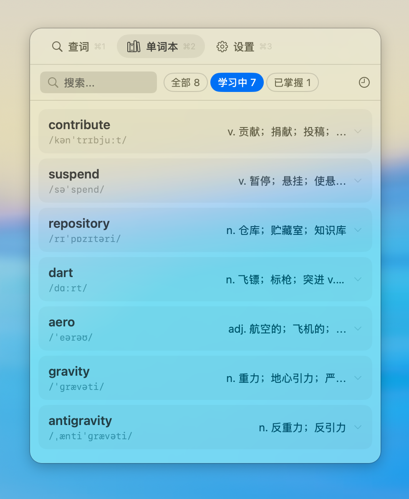
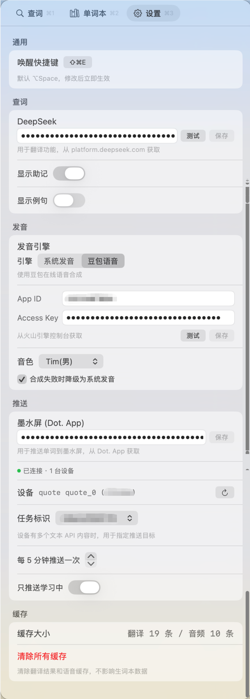

# SnapDict

macOS 菜单栏翻译词典应用，基于 AI 提供智能翻译、助记和发音功能。

| 翻译面板 | 单词本 | 设置 |
|:---:|:---:|:---:|
|  |  |  |

## 功能

- **划词翻译** — 全局快捷键唤起翻译面板，支持中英互译
- **AI 助记** — 利用 DeepSeek 生成单词记忆技巧
- **单词本** — 收藏生词，随时复习
- **TTS 发音** — 集成豆包语音合成，支持自然语音朗读
- **墨水屏推送** — 定时推送单词到墨水屏设备（TRSS）

## 系统要求

- macOS 15.0+
- Xcode 16.0+
- Swift 6.0

## 构建

项目使用 [XcodeGen](https://github.com/yonaskolb/XcodeGen) 管理工程文件：

```bash
# 安装 XcodeGen（如尚未安装）
brew install xcodegen

# 生成 Xcode 工程
xcodegen generate

# 打开项目
open SnapDict.xcodeproj
```

## 配置

应用需要在设置中配置以下 API：

| 服务 | 用途 | 必需 |
|------|------|------|
| DeepSeek API | 翻译和助记生成 | 是 |
| 豆包 TTS | 语音合成 | 否 |
| 墨水屏设备 (TRSS) | 单词推送 | 否 |

首次启动后，在菜单栏图标的设置中填入对应的 API Key。

## 快捷键

默认全局快捷键：`Cmd+Shift+E`（可在设置中自定义）

## 依赖

- [HotKey](https://github.com/soffes/HotKey) — 全局快捷键注册

## License

[MIT](LICENSE)
